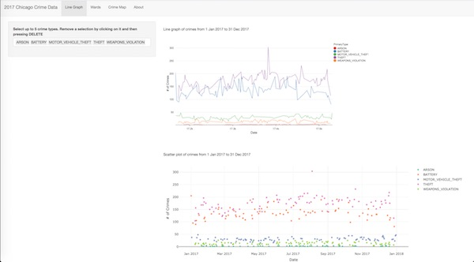
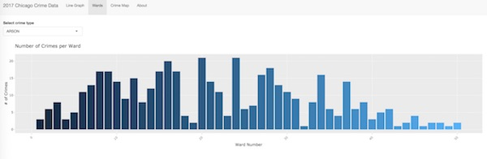
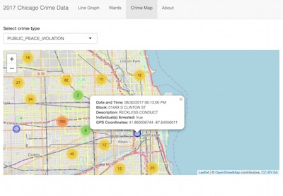

```{r setup, include=FALSE}
knitr::opts_chunk$set(echo = FALSE)
```


## Background

The app visualizes Chicago's 2017 crime data. The data set used in this assignment is availble at the [Chicago Data Portal](https://data.cityofchicago.org/Public-Safety/Crimes-2017/d62x-nvdr) and was extracted from the Chicago Police Department's CLEAR (Citizen Law Enforcement Analysis and Reporting) system. This project is a continuation of [Assignment #2](https://legoblackpanther.github.io/developingdataproducts/assignment2/assignment2.html#1) for Coursera's Developing Data Products course.

The shiny app for this project can be found [here](https://legoblackpanther.shinyapps.io/myshinypanther/).

The code for the app is located in this github [repo](https://github.com/LegoBlackPanther/developingdataproducts/tree/master/assignment3/shinyApp).

## Shiny Application
The user can visualize the data after selecting a crime type (up 5 for the line graph and scatter plot).



## Shiny Application (con't)
###### Crimes per Ward


###### Crime Locations


## Note:

##### Note: The dataset is large and there is a delay in the visualizations/graphs appearing in the app. Please be patient and allow the data to load.

```{r dataSetSize, echo = TRUE}
crimeStatsFrame<- read.csv("./testData/Crimes_-_2017.csv") 
dim(crimeStatsFrame)
head(crimeStatsFrame)
```


