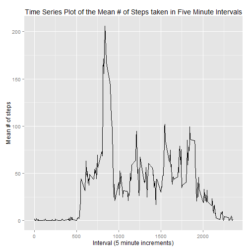
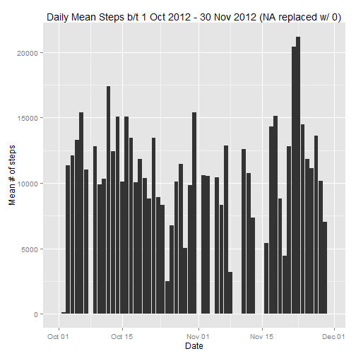
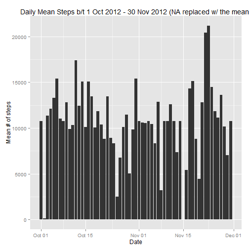
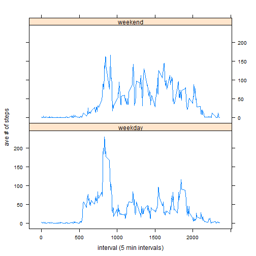

## Introduction

It is now possible to collect a large amount of data about personal movement using activity monitoring devices such as a Fitbit, Nike Fuelband, or Jawbone Up. These type of devices are part of the "quantified self" movement - a group of enthusiasts who take measurements about themselves regularly to improve their health, to find patterns in their behavior, or because they are tech geeks. But these data remain under-utilized both because the raw data are hard to obtain and there is a lack of statistical methods and software for processing and interpreting the data.

This assignment makes use of data from a personal activity monitoring device. This device collects data at 5 minute intervals through out the day. The data consists of two months of data from an anonymous individual collected during the months of October and November, 2012 and include the number of steps taken in 5 minute intervals each day.
Data

The data for this assignment can be downloaded from the course web site.

The variables included in this dataset are:

*  steps: Number of steps taking in a 5-minute interval (missing values are coded as NA)

*  date: The date on which the measurement was taken in YYYY-MM-DD format

*  interval: Identifier for the 5-minute interval in which measurement was taken

The dataset is stored in a comma-separated-value (CSV) file and there are a total of 17,568 observations in this dataset.
Assignment

This assignment will be described in multiple parts. You will need to write a report that answers the questions detailed below. Ultimately, you will need to complete the entire assignment in a single R markdown document that can be processed by knitr and be transformed into an HTML file.

Throughout your report make sure you always include the code that you used to generate the output you present. When writing code chunks in the R markdown document, always use echo = TRUE so that someone else will be able to read the code. This assignment will be evaluated via peer assessment so it is essential that your peer evaluators be able to review the code for your analysis.

For the plotting aspects of this assignment, feel free to use any plotting system in R (i.e., base, lattice, ggplot2)

Fork/clone the GitHub repository created for this assignment. You will submit this assignment by pushing your completed files into your forked repository on GitHub. The assignment submission will consist of the URL to your GitHub repository and the SHA-1 commit ID for your repository state.

NOTE: The GitHub repository also contains the dataset for the assignment so you do not have to download the data separately.

## Loading and preprocessing the data
Show any code that is needed to load the data (i.e. read.csv()) and process/transform the data (if necessary) into a format suitable for your analysis.


```r
setwd("~/Coursera/ReproducibleResearch/project001")
url <- "http://d396qusza40orc.cloudfront.net/repdata%2Fdata%2Factivity.zip"

currentDate<-Sys.Date()
formatDate <- format(as.Date(currentDate), "%Y%m%d")
currentTime <- format(Sys.time(), "_%H_%M_%S_")
file = paste(formatDate, currentTime , "repdata_data_activity", ".zip", sep = "")
download.file(url, file)
unzip(file)

options(stringsAsFactors = FALSE)
totalData <- read.csv("activity.csv", colClasses = "character")
goodData <- totalData[complete.cases(totalData),]
goodData$steps <- as.numeric(goodData$steps)
goodData$interval <- as.numeric(goodData$interval)
goodData$date <- as.Date(goodData$date)

goodDataTotalSteps <- aggregate(goodData$steps, by=list(date = goodData$date), FUN = sum)
colnames(goodDataTotalSteps) <- c("date", "steps")
```

## What is the mean total number of steps taken per day?
What is the mean total number of steps?

```r
library(ggplot2)
ggplot(goodDataTotalSteps, aes(x=date, y=steps)) + 
        geom_histogram(binwidth=0.7, stat="identity") + 
        labs(title="Total # of Steps taken Each Day (1 Oct 2012 - 30 Nov 2012)", x= "Date", y= "Total # of steps")
```

 

The mean total number of steps taken 

```r
mean(goodDataTotalSteps$steps)
```

```
## [1] 10766.19
```

## What is the average daily activity pattern?
Average activity pattern

```r
goodDataAveSteps <- aggregate(goodData$steps, by=list(interval = goodData$interval), FUN = mean)
colnames(goodDataAveSteps) <- c("interval", "mean_steps")

library(ggplot2)
ggplot(goodDataAveSteps, aes(x=interval, y=mean_steps)) + 
        geom_line(color="black") + 
        labs(title="Time Series Plot of the Mean # of Steps taken in Five Minute Intervals", x= "Interval (5 minute increments)", y= "Mean # of steps")
```

 

The time interval with the max number of steps 

```r
intervalAndSteps <- goodDataAveSteps[grep(max(goodDataAveSteps$mean_steps), goodDataAveSteps$mean_steps),]
intervalAndSteps$interval
```

```
## [1] 835
```

## Imputing missing values

```r
sum(is.na(totalData$steps))
```

```
## [1] 2304
```


Devise a strategy for filling in all of the missing values in the dataset. The strategy does not need to be sophisticated. 
For example, you could use the mean/median for that day, or the mean for that 5-minute interval, etc.
Create a new dataset that is equal to the original dataset but with the missing data filled in.

Method 1: the simplest thing to do - change the NA values to 0

```r
zeroesInMyData <- totalData
zeroesInMyData[is.na(zeroesInMyData)] <- 0
zeroesInMyData$steps <- as.numeric(zeroesInMyData$steps)
zeroesInMyData$interval <- as.numeric(zeroesInMyData$interval)
zeroesInMyData$date <- as.Date(zeroesInMyData$date)
```

Method 2: change the NA value for the 5 minute interval to the mean of the 5 minute interval

```r
meanForNAData <- totalData
for (i in 1:length(meanForNAData$steps)){
        if (is.na(meanForNAData$steps[i])){
                meanForNAData$steps[i] <- goodDataAveSteps[which(meanForNAData$interval[i]==goodDataAveSteps$interval),]$mean_steps 
        }
}

meanForNAData$steps <- as.numeric(meanForNAData$steps)
meanForNAData$interval <- as.numeric(meanForNAData$interval)
meanForNAData$date <- as.Date(meanForNAData$date)
```

Histogram for data w/ NA replaced by 0 along with the calculated mean and median

```r
library(ggplot2)
ggplot(zeroesInMyData, aes(x=date, y=steps)) + 
        geom_histogram(binwidth=0.7, stat="identity") + 
        labs(title="Daily Mean Steps b/t 1 Oct 2012 - 30 Nov 2012 (NA replaced w/ 0)", x= "Date", y= "Mean # of steps")
```

 

```r
zeroesInMyDataTotalSteps <- aggregate(zeroesInMyData$steps, by=list(date = zeroesInMyData$date), FUN = sum)
colnames(zeroesInMyDataTotalSteps) <- c("date", "steps")
mean(zeroesInMyDataTotalSteps$steps)
```

```
## [1] 9354.23
```

```r
median(zeroesInMyDataTotalSteps$steps)
```

```
## [1] 10395
```

Histogram for data w/ NA replaced by the mean for the 5 minute interval along with the calculated mean and median

```r
ggplot(meanForNAData, aes(x=date, y=steps)) + 
        geom_histogram(binwidth=0.7, stat="identity") + 
        labs(title="Daily Mean Steps b/t 1 Oct 2012 - 30 Nov 2012 (NA replaced w/ the mean)", x= "Date", y= "Mean # of steps")
```

 

```r
meanForNADataTotalSteps <- aggregate(meanForNAData$steps, by=list(date = meanForNAData$date), FUN = sum)
colnames(meanForNADataTotalSteps) <- c("date", "steps")
mean(meanForNADataTotalSteps$steps)
```

```
## [1] 10766.19
```

```r
median(meanForNADataTotalSteps$steps)
```

```
## [1] 10766.19
```

Here is a table that compares the mean and median of the different data sets: 1. NA removed, 2. zeroes replacing NA, 3. 5 minute interval mean replacing NA

```r
NA_removed <- c(mean(meanForNADataTotalSteps$steps), median(meanForNADataTotalSteps$steps))
zero_replace_NA <- c(mean(zeroesInMyDataTotalSteps$steps), median(zeroesInMyDataTotalSteps$steps))
mean_replace_NA <- c(mean(goodDataTotalSteps$steps), median(goodDataTotalSteps$steps))
calculation <- c("mean","median")
meanAndMedianData <- data.frame(calculation,NA_removed,zero_replace_NA, mean_replace_NA)
meanAndMedianData
```

```
##   calculation NA_removed zero_replace_NA mean_replace_NA
## 1        mean   10766.19         9354.23        10766.19
## 2      median   10766.19        10395.00        10765.00
```
There's no real difference between the mean and median of the data set where NA was removed and the data set where NA was replaced with the mean for the 5 minute interval. However, there is a significant difference when comparing the data set where NA was replaced with 0

## Are there differences in activity patterns between weekdays and weekends?
For this part the weekdays() function may be of some help here. Use the dataset with the filled-in missing values for this part.

Create a new factor variable in the dataset with two levels - "weekday" and "weekend" indicating whether a given date is a 
weekday or weekend day.

```r
meanForNAData$day <- factor(weekdays(as.Date(meanForNAData$date)))

dayType <- c('weekend','weekday','weekday','weekday','weekday','weekday','weekend')
day <- c('Sunday','Monday','Tuesday','Wednesday','Thursday','Friday','Saturday')
day.data <- data.frame(dayType,day)
day.data$dayType <- factor(day.data$dayType)
day.data$day <- factor(day.data$day)

completeMeanForNAData <- merge(meanForNAData, day.data, "day")
completeMeanForNAData <- completeMeanForNAData[order(completeMeanForNAData$date),] 
```

Make a panel plot containing a time series plot (i.e. type = "l") of the 5-minute interval (x-axis) and the average number 
of steps taken, averaged across all weekday days or weekend days (y-axis). See the README file in the GitHub repository to 
see an example of what this plot should look like using simulated data.

```r
aveStepsCompleteData <- aggregate(completeMeanForNAData$steps, by=list(interval = completeMeanForNAData$interval, dayType = completeMeanForNAData$dayType), FUN = mean)
colnames(aveStepsCompleteData) <- c("interval", "dayType", "meanSteps")

library(lattice) 
xyplot(aveStepsCompleteData$meanSteps ~ aveStepsCompleteData$interval | aveStepsCompleteData$dayType, layout = c(1,2), type = "l", xlab = "interval (5 min intervals)", ylab ="ave # of steps")
```

 


